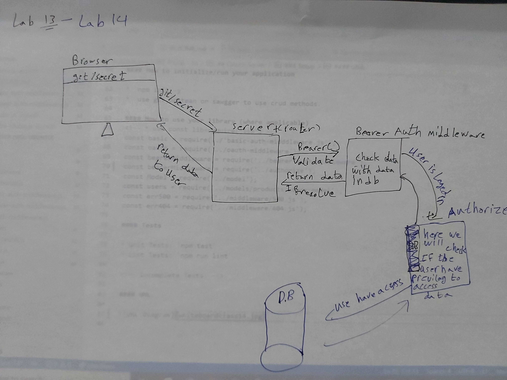

# LAB - 14
<!-- ## Project: Project Name Here -->
## OAuth Server

### Author: Abdallah Obaid

### Links and Resources

* [submission PR](https://github.com/Abdallah-401-advanced-javascript/auth-server/pull/4/)
* [travis](https://github.com/Abdallah-401-advanced-javascript/auth-server/pull/4/checks?check_run_id=760151157)
* [ci/cd](https://github.com/Abdallah-401-advanced-javascript/auth-server/pull/4/checks?check_run_id=760151228)
<!-- - [back-end server url](http://xyz.com) (when applicable) -->
<!-- * [front-end application](https://abdallah-lab-00.herokuapp.com/)  -->

### Documentation
<!-- * [jsdoc](https://abdallah-lab-00.herokuapp.com/docs/) -->
<!-- * [swagger](https://app.swaggerhub.com/apis/AbdallahObaid/class-06/0.1)  -->

### Modules
#### `basic-auth-midddleware.js` , `500.js`, `404.js`, `model.js`, , `user-model.js`,`timestamp.js`, `router.js`, `oauth-middleware.js`, `bearer-auth-middleware.js`,`authorize`.
##### Exported Values and Methods

###### `node index.js `
This will start listening.
###### `router`
This will send request to the user crud handler `users-model.js`
###### `users-model.js`
This will connect the main crud handler `model.js` with the products schema `users-schema.js`
###### `model.js`
This is the main crud handler.
###### `timestamp.js`
This Will log the date for the request to the terminal. 
###### `404.js`
This will console for not exist route.
###### `500.js`
This will console the server errors.
###### `basic-auth-midddleware.js`
This will authinticate the login process
###### `oauth-middleware.js`
This will make an authorization for the client from third-party.
###### `bearer-auth-middleware.js`
This middleware will use baerer jwt to check authorization for the client before send it to the main function in the route.
###### `authorize`
This will check if the user has the privilege to access a route.

### Setup

#### `.env` requirements 
PORT=3030
MONGODB_URI=mongodb://localhost:27017/class-11-db
SECRET=ysecrettokenkey
CLIENT_ID=7d4f153cec56a80adbbc
CLIENT_SECRET=d5330f11d3fb407e0308061307cb688dac938c82
TOKEN_SERVER_URL=https://github.com/login/oauth/access_token
REMOTE_USER_API=https://api.github.com/user
API_SERVER=http://localhost:3030/oauth

#### How to initialize/run your application 

* `npm init -y`
*  use git,postman or sawgger to use crud methods.

#### How to use your library (where applicable)
<!-- * use const lib=require('lib') -->
const basic = require(../'basic-auth-midddleware.js');
const oauth = require('../oauth-middleware');
const bearerMiddleware = require('../bearer-auth-middleware');
const bearerMiddleware = require('../authorize');
const Model = require('../model');
const users = require('../models/products/users-model');
const err500 = require('../middleware/500.js');
const err404 = require('../middleware/404.js');

#### Tests

* Unit Tests: `npm test`
* Lint Tests: `npm run lint`

<!-- Incomplete Tests: -->

#### UML

